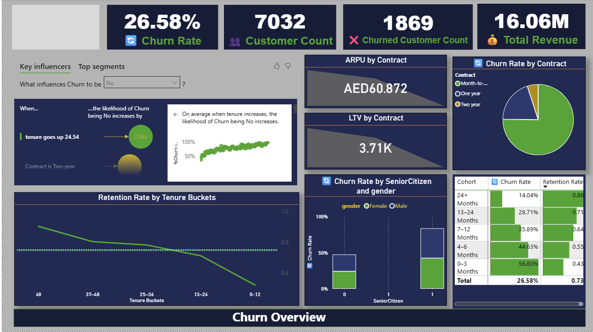
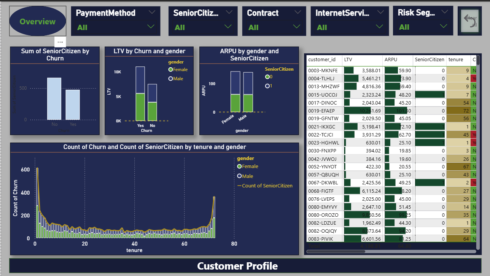
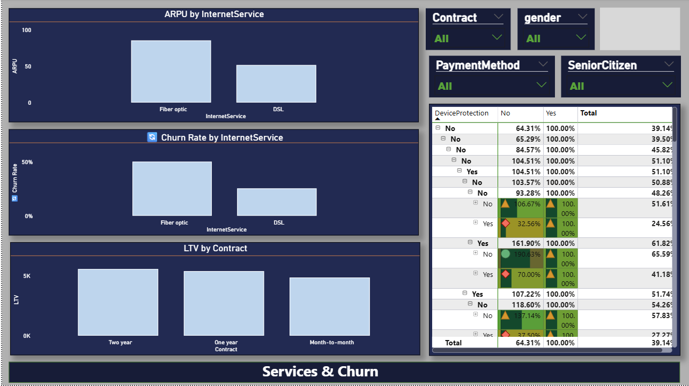
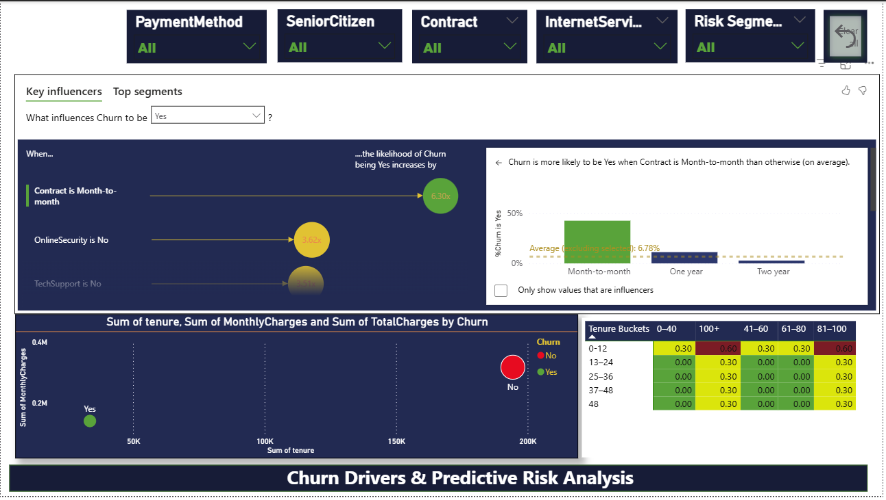
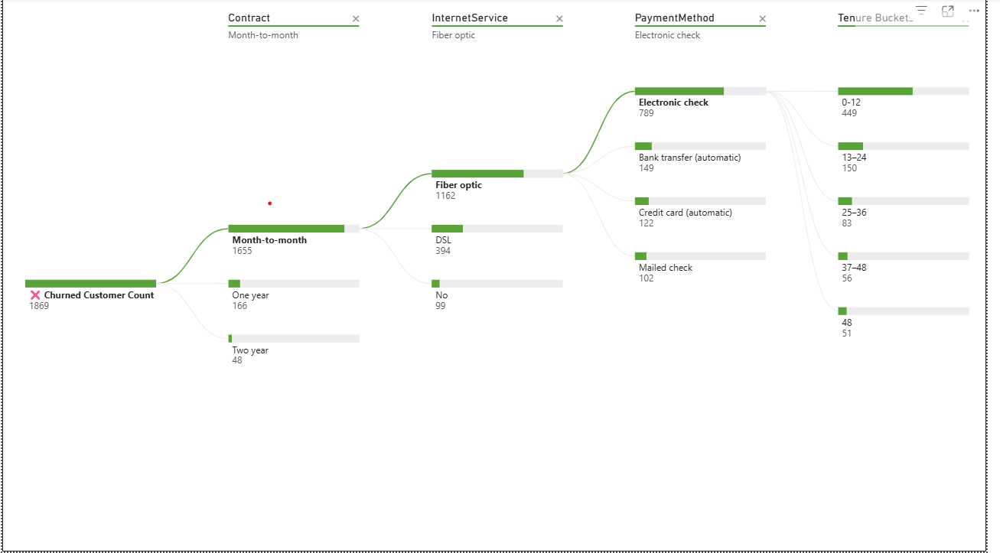

📡 Telecom Customer Churn Business Intelligence Project
1️⃣ 📌 Business Problem

Telecom companies face significant revenue loss due to customer churn.
The objective of this project is to:

Analyze churn behavior

Identify high-risk customer segments

Evaluate revenue impact

Provide actionable retention strategies

This project simulates a Business Intelligence use case for telecom operators.

2️⃣ 📊 Dataset Description

Source: Kaggle – Telco Customer Churn Dataset

The dataset contains customer-level information including:

Demographics

Contract type

Tenure

Payment method

Monthly charges

Total charges

Churn status

Total records: ~7,000 customers

3️⃣ 🧱 Data Architecture

The raw dataset was transformed into a basic star schema model:

dim_customer

fact_billing

This enables scalable KPI computation and business reporting.

⭐ Data Model

4️⃣ 🛠 Tools & Technologies

MySQL (Data storage & SQL analytics)

Power BI (Dashboard & visualization)

GitHub (Version control & portfolio)

SQL (KPI queries & business analysis)

5️⃣ 📈 Key Business KPIs
🔹 Total Revenue
🔹 Average Revenue Per User (ARPU)
🔹 Churn Rate
🔹 Revenue by Contract Type
🔹 High-Value Customer Identification

6️⃣ 🔎 SQL Analysis Highlights
SELECT 
    Contract,
    COUNT(*) AS total_customers,
    SUM(CASE WHEN Churn='Yes' THEN 1 ELSE 0 END) AS churned,
    ROUND(SUM(CASE WHEN Churn='Yes' THEN 1 ELSE 0 END) 
          / COUNT(*) * 100,2) AS churn_rate
FROM dim_customer
GROUP BY Contract;

Month-to-month contracts exhibit significantly higher churn rates compared to one-year and two-year contracts.

7️⃣ 📊 Power BI Dashboard

The executive dashboard includes:

Revenue KPI cards

ARPU tracking

Churn % visualization

Revenue by contract type

Customer segmentation

High-value customer identification

8️⃣ 💡 Key Business Insights

Customers with month-to-month contracts have the highest churn rate.

Higher monthly charges correlate with increased churn probability.

Long-tenure customers generate significantly higher lifetime value.

Electronic check payment method shows higher churn concentration.

9️⃣ 🚀 Strategic Recommendations

Introduce contract upgrade incentives for month-to-month customers.

Offer loyalty rewards for customers exceeding 24 months tenure.

Implement targeted retention campaigns for high-charge segments.

Improve payment experience to reduce churn linked to electronic check users.

🔟 📂 Project Structure
Telecom-Churn-BI/
│
├── data/
│   └── telco_churn.csv
│
├── sql/
│   ├── schema.sql
│   ├── kpi_queries.sql
│
├── powerbi/
│   └── telecom_dashboard.pbix
│
├── README.md
